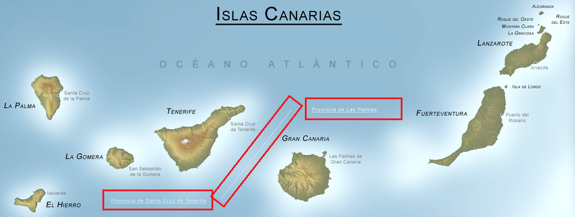
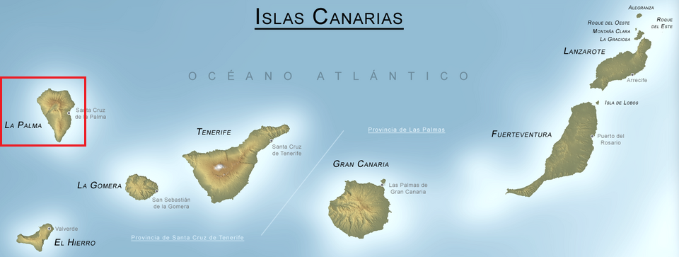
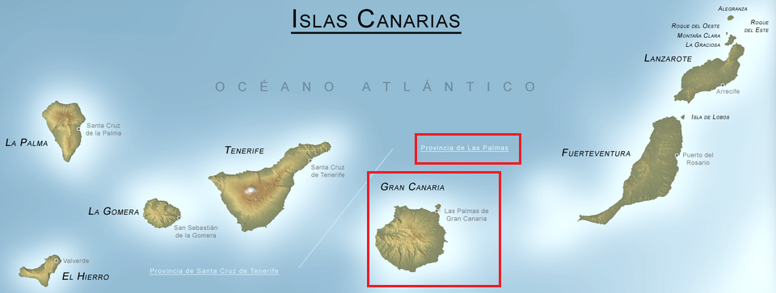
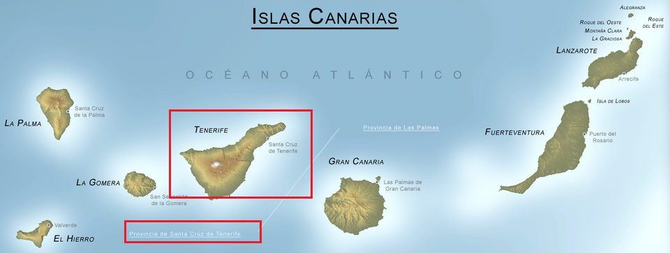

I have just come back from a one-week holiday in Lanzarote, in the Canary Islands. This is not a travel blog so I won't elaborate much on my trip; my goal for this entry is to shed light on the confusing names of the territories you can find in the islands.

# The Canary Islands administrative names

First, let's clarify the administrative division of the Spanish territory. At the top we find the state (Spain), followed by what we call autonomic communities like Andalusia, Catalonia or Galicia. The next divisions are the provinces, like Almería and Seville, being part of Andalusia, or Lerida or Barcelona, part of Catalonia. The smallest division is the council. For example, I live in Roquetas de Mar (council), belonging to the Almería province.

Back to the Canary Islands, the archipelago itself is an autonomous community of two provinces: **Santa Cruz de Tenerife** and **Las Palmas**. This is sometimes represented on the map by a diagonal line splitting the islands into two groups

**La Palma** island is located at the north-western side and known for the 2021 eruption of the Cumbre Vieja volcano. Its capital city goes by the name **Santa Cruz de la Palma**. Well, this island DOES NOT BELONG to Las Palmas province, but to Santa Cruz de Tenerife.

**Gran Canaria** (translated to Great Canary Island) island is the third biggest and its capital, the most populated city of the archipelago, goes by the name **Las Palmas de Gran Canaria**. This island does belong to Las Palmas province. This is somewhat confusing because the city name can be shortened to Las Palmas, so you need context to tell apart whether the speaker refers to the city or the province.

**Tenerife** is the biggest island by surface. The tallest point of Spain is located here in *The Teide* mountain with its summit at 3715 meters. Its capital city is **Santa Cruz de Tenerife** that goes by the same name as the province. Its second most populated city goes by the name **Puerto de la Cruz**

# A few notes about my trip to Lanzarote

I've spent a week discovering Lanzarote. This is the oldest island, known for its volcanic landscapes. Its weather is mild like in the rest of the archipelago, but due to its low terrain, it does not enjoy enough rainfall, so vegetation is sparse. Although this made for very harsh living conditions in the past now we can enjoy a moon- or Mars-like landscape without the vegetation breaking the illusion.

We've followed [the following guide](https://puntodepartidaaragon.com/que-ver-en-lanzarote-en-7-dias/) (in spanish) She has also built a Google Maps with the most important spots pinned, colour-coded for each day of the 7 days visit.

The only remark I'd like to make is that I do recommend the bus trip through the *Montaña de Fuego*. It's a bit expensive compared to what's asked for other amenities on the island, but the track was designed by [César Manrique himself](https://es.wikipedia.org/wiki/C%C3%A9sar_Manrique), and they've upgraded the bus having huge clean windows that allow for a clear view of the landscapes. Indeed, you're not allowed to leave the bus at any moment, but I recommend it nonetheless.

