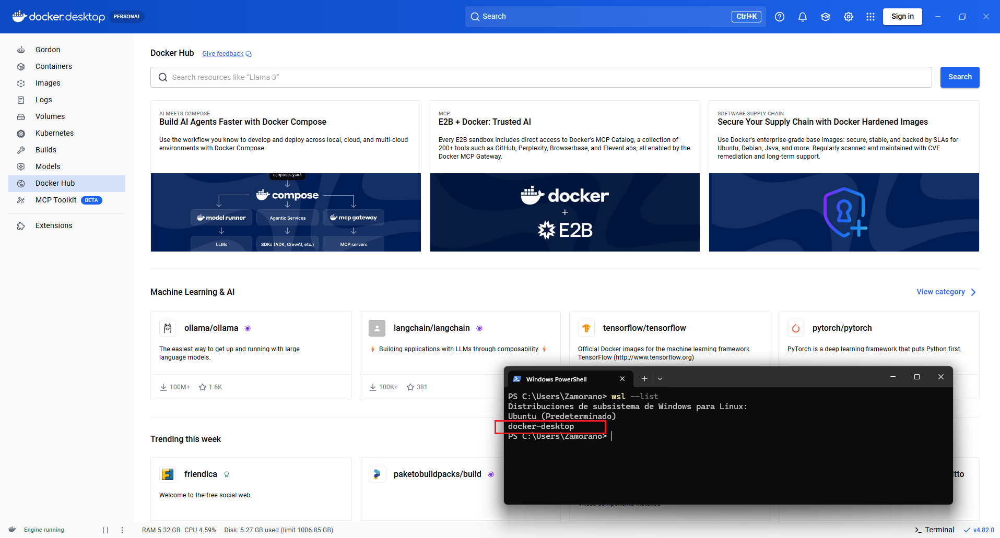
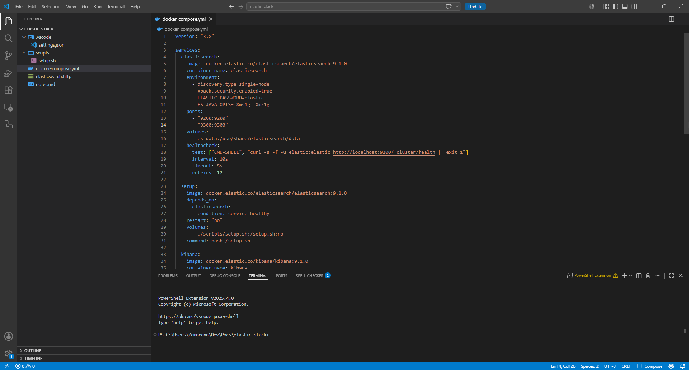
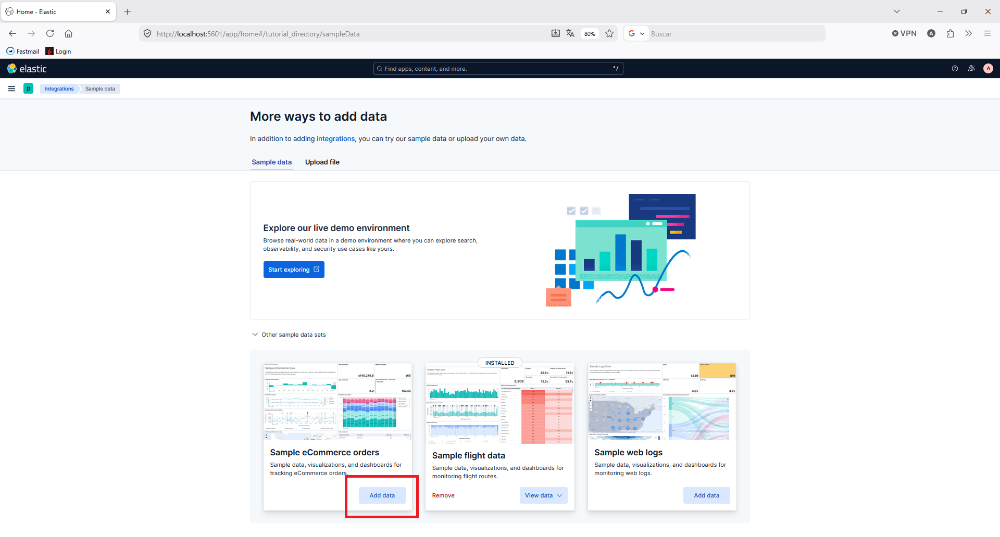
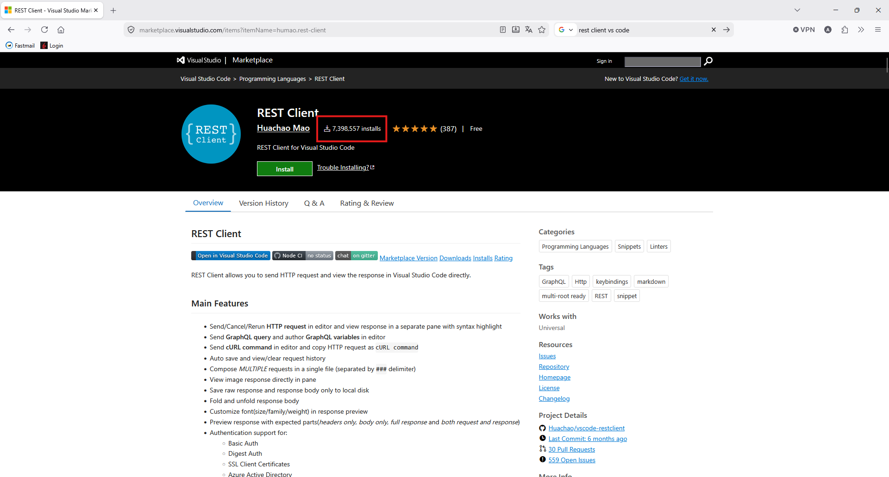
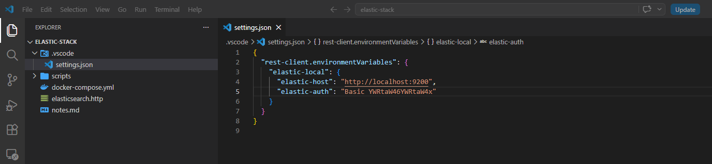
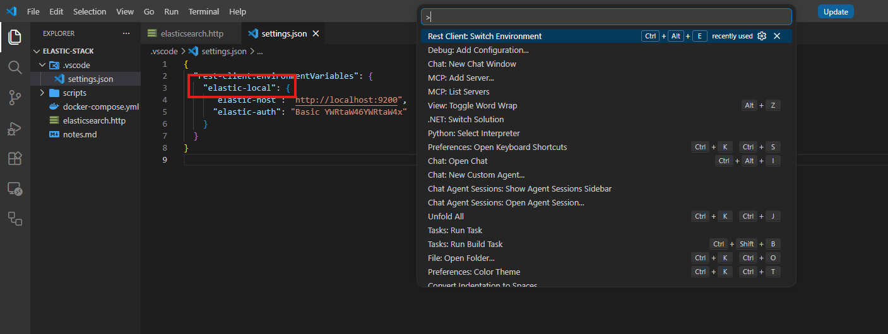
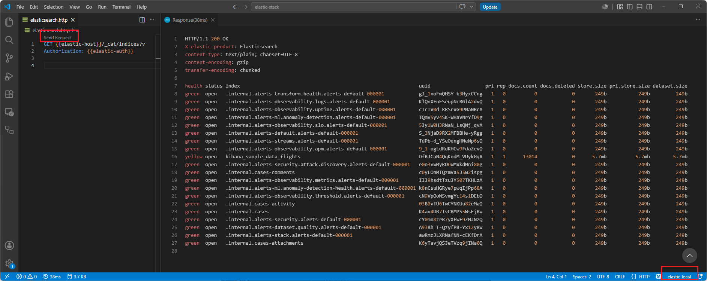
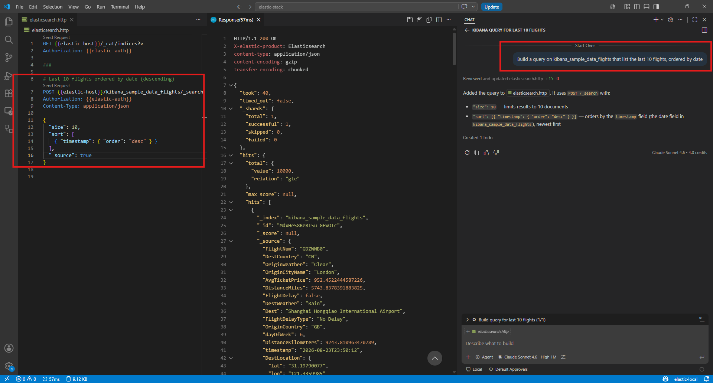
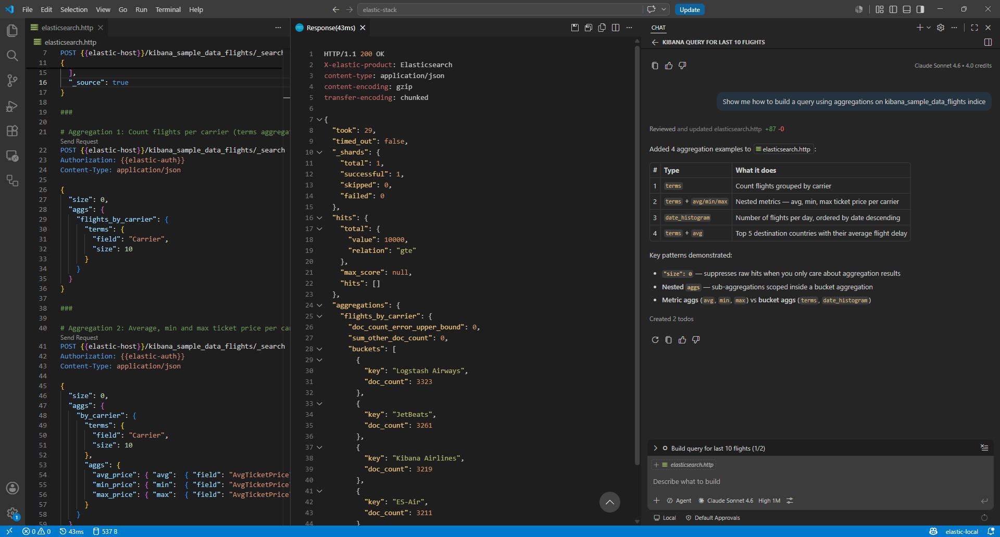

At day-job we use a dual database setup, a standard relational database and Elasticsearch when the volume of the stored data gets too big, and it does get big.

I don't feel at ease with Elasticsearch.

First, I'm already a veteran. I graduated from computer science in 2002. Back then, when you got out of college you had your standard `SELECT...FROM...JOIN...WHERE...GROUPBY...HAVING` in the playbook but NoSQL was not something most people know about. In fact, according Wikipedia the term NoSQL popularized in the early 2000, [MongoDB](https://en.wikipedia.org/wiki/MongoDB) launched its first version in 2009 and [Elasticsearch](https://en.wikipedia.org/wiki/Elasticsearch) in 2010.

My first contact with NoSQL was a MongoDB course I completed, run by the company itself. I recall it of high quality; its scope was not limited to a few standard operations, but expanded to complex queries and situations. I remember myself struggling for a while with some exercices and even failing a lesson. After completion, time went by and I never had the need to use NoSQL professionaly, so I mostly forgot all I had learnt, until I got to my current position.

My team leader holds most of the load of handling our Elasticsearch cluster, but from time to time I need to debug a query to diagnose a bug in the application. On those ocassions, what I do is debug the source code until I get to the code spot where I can check the returned `DebugInformation`. Then I log in to Kibana Dev Tools, paste the query and check its results, tweak the query, check results again, until I'm able to spot the problem. Sometimes I need the LLMs to help me so I need to paste the query results to whatever UI I'm using for an AI agent.

The problem is the above method is slow and tiresome. I sometimes just need something like the last 10 records, ordered by a given keyword. On those ocassions I also need to do the above steps since I don't have a query catalog for each indice and I'm not skilled enough to build a query from scratch. So I need to speed up this process and I though AI might help me.

First, I'm going to setup Elasticsearch at my home Windows computer so I'm free to mess with the cluster if so I decide. The easiest way is installing a container using Docker Desktop. In Windows, Docker Destkop can be run using either Hypervisor or WSL2. I chose the second options as docker claims is more performant and I have WSL2 already installed in my computer

Now I need to install Elasticsearch and Kibana. I'd rather ask Claude help me create a `docker-compose.yml` using basic authentication

Now that I have Elasticsearch and Kibana running, I now need sample data that, luckily, Kibana provides

I use Visual Studio / Visual Studio Code as my daily drivers. I like their integration with Github Copilot although I haven't experienced any other AI powered IDE. The point of this entry is taking advantage of its agent integration so I don't have to go back and forth to Kibana in the web browser. So I need a way to interact with Elasticsearch from VS Code. Queries can be run in many ways, on of those being REST calls using curl, or any other client. It seems convenient so I'm installing the most popular [REST Client extension](https://marketplace.visualstudio.com/items?itemName=humao.rest-client) in VS Code

This extension allows storing several data profiles in `settings.json` file.

You can activate that profile using the following command so the server url and authentication are available for each query.

I can now run a basic query to list all indices

Let's use Claude to get the last 10 flights without bothering about syntax considerations

How do I aggregate results in Elasticsearch? Let's Claude show

Using this extensions queries can be saved so I can keep each one in separate folders. That's handy for me so I can store them in each JIRA ticket.