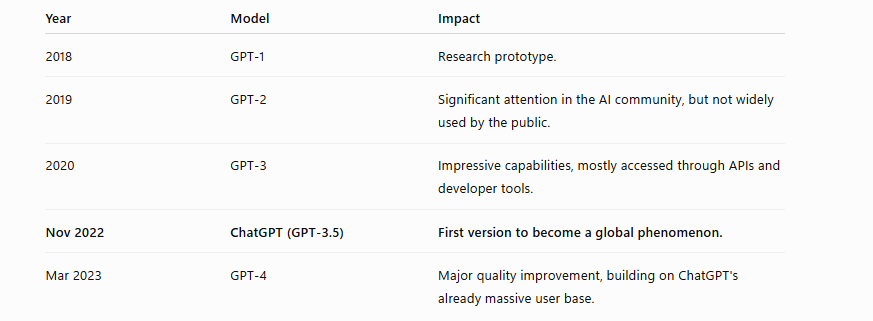
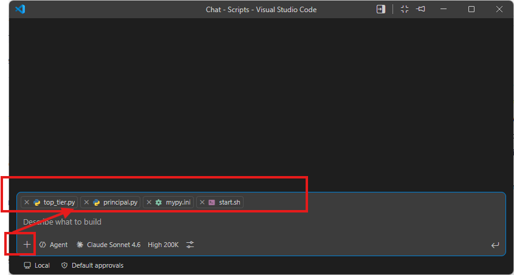
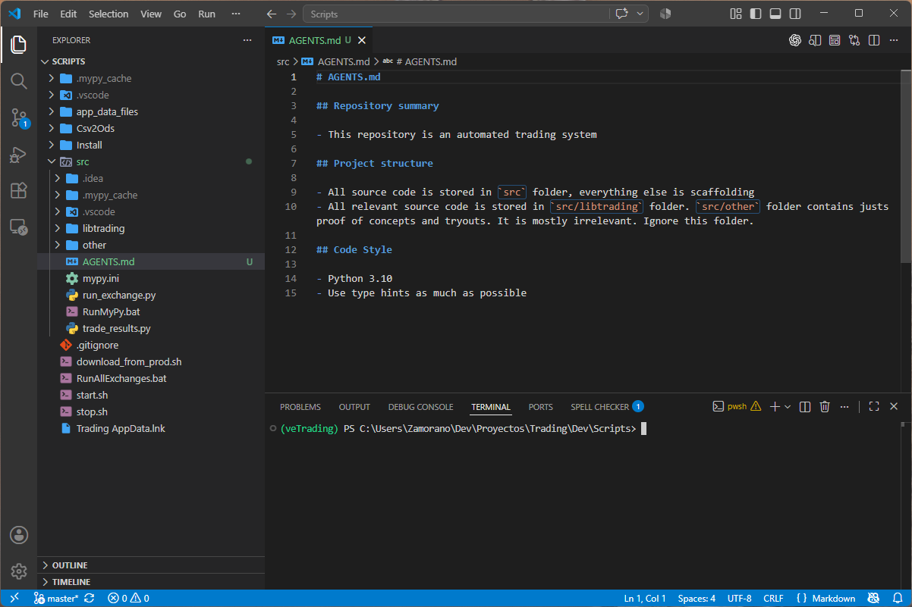
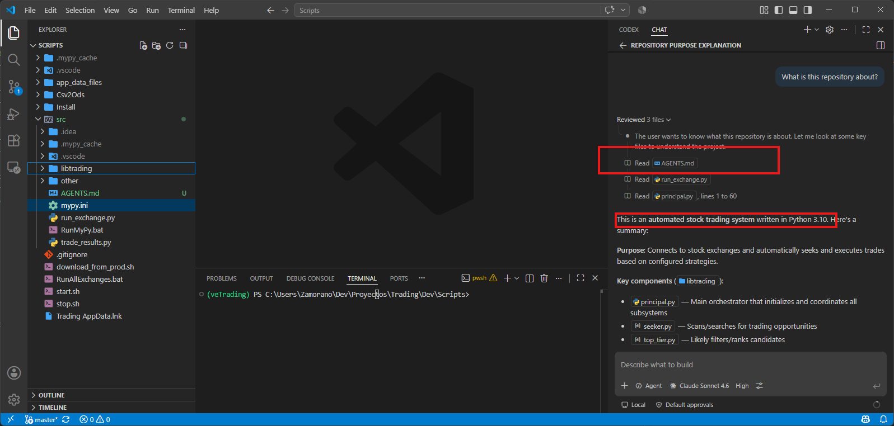

# My AI assisted coding history 

It seems ages have passed by, but it was only 2020 when ChatGPT-3 was released. We developers and technology enthusiasts had been aware, but in November 2022 ChatGPT-3.5 was released to the mass market and rocked the world. This is the timeline

At first I used the thing as many other developers, I assume. Just copy and paste from the browser or ChatGPT app to the IDE. This was fine for scripts or very localized problems and that small assistance on my daily coding would be enough for a couple of years until I subscribed to GitHub Copilot in August 2025.

As I write, I'm checking the release dates of the main AI coding assistants. I'm surprised to learn GitHub Copilot was among the first in October 2021, earlier than Cursor and Windsurf, both released in 2023. But I didn't know OpenAI themselves were behind GitHub Copilot, so now things make sense.

But back to my use case. Since I subscribed to Copilot, I've been gradually increasing its usage. For the first 7 months the $10 tier (Copilot Pro) was enough for me; I rarely ran out of tokens. For the most part I kept doing manual coding and I usually selected the free models for basic syntax assistance and switched to paid models only when required. But in February of this year I changed to Copilot Pro+ because I had stopped using free models and despite still coding, the AI was becoming so good I kept coming back to the agent more and more.

It has now reached an ability level such that, for developing a prototype from scratch, manual coding is a waste of time. However, for production environments with large and complex codebases things get trickier. On one hand, assuming a localized problem in a single source code file, the agents are also wiser but, more importantly, make far fewer errors than a lowly human developer. On the other hand, the thing is **unable to keep all the context of such big codebases, and navigating many files takes a long time and consumes many tokens**.

The obvious approach is using manual references to tell the agent which files to consider

But it would be great if the agent knew how to navigate the codebase without me constantly assisting it. Furthermore, after recent updates in Copilot pricing and the stock exchange frenzy, token cost is increasing by the day.

My next step in AI coding is to sort these problems out.

# Next steps in AI coding

Before I start, a prerequisite. For my private project repositories the remote is a Linux box I have at home. I keep some projects hosted on GitHub but many aren't, so the idea is, despite using Copilot, to ignore GitHub-only features to avoid lock-in. So features as shown in this page [Copilot on GitHub](https://docs.github.com/en/copilot/how-tos/copilot-on-github/set-up-copilot/configure-access-to-ai-models) Ideally all AI enhancements should be as portable as possible. At day-job my employer has provided the developers with ChatGPT Codex accounts, so I can compare both systems to see whether things work on both.

## Persistent codebase instructions

The information shown in [GitHub Copilot in your IDE](https://docs.github.com/en/copilot/how-tos/configure-custom-instructions-in-your-ide/add-repository-instructions-in-your-ide) supports well-known IDEs: VS Code, Visual Studio, JetBrains, Eclipse and Xcode. I think any IDE would work, so that's a good starting point.

We can define a `.github/copilot-instructions.md` file to write repository-wide instructions. This is a copilot-only feature. We can also create `AGENTS.md` files to define instructions in a given folder or the directory root. This latter feature is an [open documented standard](https://github.com/agentsmd/agents.md) adopted by all major players, so I'm going with this.

According to the docs, in Visual Studio Code we can check that our instructions have been considered by looking at the references the agent shows after responding.

> The instructions in the file(s) are available for use by Copilot as soon as you save the file(s). Instructions are automatically added to requests that you submit to Copilot.
>
> Custom instructions are not visible in the Chat view or inline chat, but you can verify that they are being used by Copilot by looking at the References list of a response in the Chat view. If custom instructions were added to the prompt that was sent to the model, the .github/copilot-instructions.md file is listed as a reference. You can click the reference to open the file.

I have a trading bot repository that has never made any money. At least it's going to be useful for testing AI features and, hopefully, for being my first agent-first personal project.

Let's create my first top-level `AGENTS.md` file

Pretty straightforward. I just state the purpose of the repository and give simple navigation hints.

Let's ask the agent what this repo is about, and check whether it queried the file. Obviously, I won't give a manual reference to check whether it automatically grabs information from the file

Fine, it got the memo. Now I can keep writing AGENTS.md files in each folder, giving granular information for each module.

