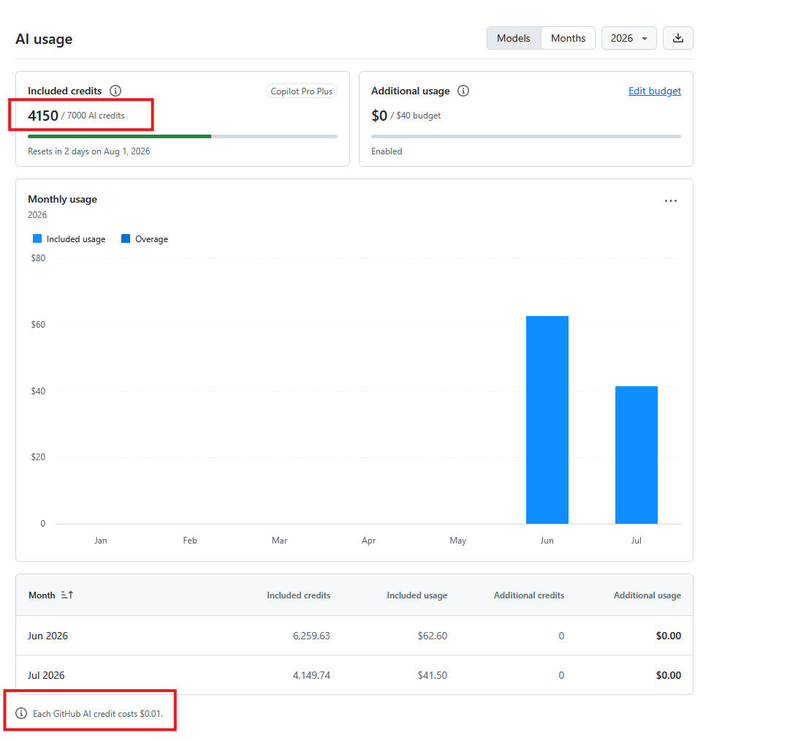

In my last post I spoke about how I've been gradually adopting AI-assisted coding. I didn't think much about costs because the tool has been improving over time and it's come to a point where I acknowledge I rely on assistants, and by doing manual coding my productivity would take a major hit. For now I feel every euro spent has been worth it, so I mostly ignore the money side. However, how can you not notice the humongous investments being made in datacenters, the crazy valuations of companies yet to turn a profit, and the worrying news of layoffs by the big American companies? That makes you think about how this frenzy is justified from a financial standpoint; the LLMs themselves are a marvel. How are those companies going to make all that money back? Sure, although I'm a developer, I'm a European in a low-income country. I'll surely pay some euros each month on tools, but I don't see coders around here spending in ways that would make the financial side add up. Maybe in the US things are different and devs are spending like $1000/month on AI tools, but I don't plan to increase my spending much and I don't think my employer is either. Furthermore, from the laypeople side, I don't know a single person paying for an AI assistant. But honestly, in Spain we're very frugal; the free versions should be barely functional before anyone decides to spend even €10 on software.

Anyway, I'm rambling. My goal for this post is to summarize how much I'm spending in GitHub Copilot and how I'm using the tool. First, right now I'm on GitHub Copilot Pro+

I'm spending $39/month, but my plan, as I've highlighted, has an additional allowance of $70. Of course, a menacing footnote says they're free to remove that kindness whenever they feel like it

Let me log in to my Copilot administration page

The first thing I notice is that the admin page's measurement unit is the *AI Credit*, not what I'd expect: tokens. We'll elaborate on that later but, for now, if each credit costs $0.01, my monthly budget would be 3900 credits. I'm currently at 4150 but, due to that allowance I noticed later, my monthly budget is 7000 credits. This limit might drop to 3900 at any moment, so when/if that happens I'll start burning through my additional usage, which I've set to another $40. It's also remarkable that the chart starts counting in June 2026. This is because GitHub changed [its billing structure](https://github.blog/news-insights/company-news/github-copilot-is-moving-to-usage-based-billing) recently. They came up with this AI Credit unit and disabled fallback mode when a user burns through their entire budget. I didn't notice anything since the costs remained the same.

Now, what are AI Credits? This is what [GitHub docs](https://docs.github.com/en/copilot/concepts/billing/usage-based-billing-for-individuals#what-are-github-ai-credits) says

>When you use Copilot, the interaction consumes tokens: input tokens (what's sent to the model), output tokens (what the model generates), and cached tokens (context the model reuses or stores). Each token is priced based on the model used.
>
>The cost of an interaction therefore depends on two things:
>
>    1. The model used
>    2. The number of tokens consumed
>
>This total is converted into **AI credits** (1 AI credit = $0.01 USD).

This seems reasonable to me since tokens alone cannot be a good measurement. The same request would take the same amount of tokens for a weaker model, say GPT-5 Mini, as for a state-of-the-art model like Claude Opus 5.

