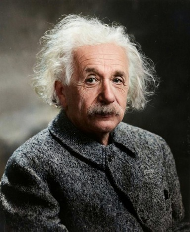
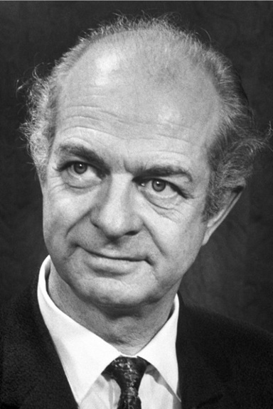
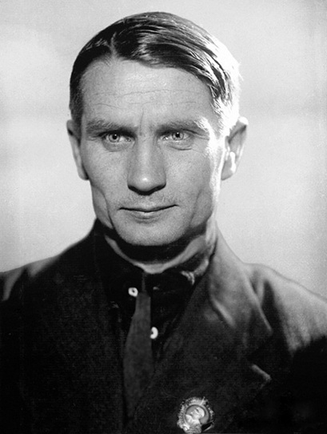
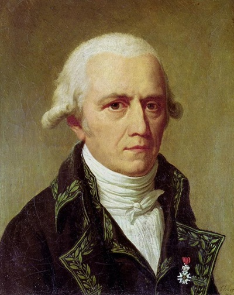

When policy topics overlap with the scientific domain, it is commonly repeated by politicians and journalists that the voice of scientists must be followed without further consideration. That implies that, at least in those instances, researchers are not like regular people, as their thoughts are shaped by the scientific method and the biases affecting laypeople don't apply to them. Since they are experts in deep domains that cannot be effortlessly weighed, their advice must be followed. I think it's important for a regular citizen to understand whether those assertions are self-evident or whether scientific opinions must still be questioned, as they are more and more impacting our daily lives.

In the long run, the success of the scientific method has been proven. From the 17th century to our days, advances in all fields have shaped the world to humankind's will, but blinded by that success we tend to forget progress is not linear, that scientists follow human impulses and, sometimes, their theses have provoked regressions and much human suffering.

Let me start first with [Albert Einstein](https://en.wikipedia.org/wiki/Albert_Einstein), one of the most brilliant human minds. Here I'm leaving the relativity theory aside to focus on quantum theory. In 1905, alongside his famous work on special relativity and the photoelectric effect, Einstein also worked on quantum physics, so he was one of the field's pioneers. Fast forward to 1920, he's now 41, and Werner Heisenberg and Erwin Schrödinger developed what we now call quantum mechanics. It is well documented that Einstein rejected quantum mechanics despite numerous successful experiments backing its hypotheses. But as the scientific method is empirical, if the evidence points to a conclusion, a good scientist is supposed to leave his conjetures aside make a u-turn if required and follow the evidence. But Einstein didn't; he spent the last years of his career on the losing side, **not really following the scientific method**. It is not a stretch to wonder whether **ego bias** got the best of him, and once he famously stated that 'God does not play dice', as the portrait of a genious he was, he could no longer safely get off that boat.

Let me now follow with [Linus Pauling](https://en.wikipedia.org/wiki/Linus_Pauling), less famous but a luminary nonetheless. Nobel Prize winner and one of the 20 greatest scientists of all time, according to Scientific American. In 1960 he was 59 years old and extremely famous when he developed an obsession with vitamin C. Against all evidence he advocated the vitamin as a cancer treatment, **ignoring the scientific method** and fell prey to **ego bias** as he developed a strong conviction and became emotionally invested in this hypothesis. He took it as far as consuming around 12 grams per day. Pauling's case was even worse than Einstein's because the German was competent in quantum mechanics, but Linus's overconfidence in a strange field was striking. 

So far we've learnt how brilliant minds' judgement is clouded by human passions but we also have instances of the opposite effect; how groupthink and **majority bias** affect the scientific field and how the **scientific consensus** is in reality deeply anti-science. Research is truth seeking, not democracy nor a popularity contest. Although head count can be a loose guide, skepticism is paramount, as [Alfred Wegener](https://en.wikipedia.org/wiki/Alfred_Wegener)'s historical example shows. In 1912 he came up with the theory of continental drift, and how the continents had once been joined together and slowly moved away to the disposition we currently see. He didn't just state his theory but collected evidence to support it, yet it was rejected by the scientific majority every time. By the time he died in 1930, his theory remained in the minority until the 50s and 60s, when further discoveries changed the situation. We now know the entire field was wrong and Wegener was right. Worthwhile remembering when politicians and journalists define who's doing real science and who's a fringe loose cannon.

**Economic interests** also drive scholars away from truth. We understand how money corrupts and how it takes rare personality traits to disregard personal gain in favor of truth-seeking. I'm not elaborating on well known examples of corruption like in the tobacco or the chemical industry (leaded oil, asbestos, PFAS...) when big corporations straight up bought scientists. That the money of large companies can corrupt is a fact we know, but somehow we tend to give a pass to publicly funded researchers because the money is not that big. But putting food on the table, and not greed, is also a powerful motivator. Scientists can calmly publish their papers as long as they stay in obscure topics and don't step out of the line of what politicians and journalists consider acceptable. Here in Spain we conflate 'public sector' with 'independent' and 'citizen-owned' when in reality politicians, whose incentives we cannot change at the voting poll, are the rulers of the public sector and make it what it is; if you feel politicians are corrupt and their professionality is plummeting, chances are the public sector is following their trajectory.

Although economy and politics usually go hand in hand, we can emphasize **political bias** in science with the case of the infamous [Trofim Lysenko](https://en.wikipedia.org/wiki/Trofim_Lysenko). Lysenko became the director of the Soviet Academy of Sciences by being nasty at the political game and ignoring unbiased research. Once there, in good terms with the top Soviet leaders, he proceeded to apply Lamarckist non-Mendelian concepts to the agricultural collectivization efforts of the government. In disregard of the scientific method, the disastrous results of his policies provoked famines while the press published success stories.

We, as all people living in any epoch, call our times 'modern' and look with disrespect at the customs and people of the past, as if their behaviour was backwards or primitive, so we have a tendency to assume those things could not happen now, despite the above examples being modern by historical timeline standards. If we dig a little, we can find contemporary examples of scientific interpretations being updated or totally changing. Things like the traditional food pyramid we've been advised on by doctors through the years are little by little being updated, but as I have already mentioned Lysenko, I'd like to write some more about Lamarckism and how it is making a qualified comeback.

First I want to clarify that, unlike Lysenko, [Jean-Baptiste Lamarck](https://en.wikipedia.org/wiki/Jean-Baptiste_Lamarck) was a good scientist who, doing good science and using the tools available to him in his times, produced a wrong theory. Lamarckism consists of the inheritance of acquired characteristics, meaning that `an organism can pass on to its offspring physical characteristics that the parent organism acquired through use or disuse during its lifetime`. Indeed this has been proved wrong, and a rejection of any non-Mendelian inheritance mechanism developed over the years. But once again reality proved that scientific consensus is fickle, and recent studies of epigenetics are proving that a restricted version of Lamarckism might still be valid. As an example, in World War II, after a German siege of the Netherlands, pregnant women suffered mild food restriction, but after returning to normalcy and successful childbirth, that generation showed a tendency to become fat, as their metabolism had been 'programmed' for efficiency by their mothers during that time of food scarcity.

Close to finishing this post, and after so many negative examples, I'd like to end with a constructive outlook. Showing the importance of science is pointless because facts speak for themselves; for each negative example I've found, I can also write about hundreds of instances when the scientific method worked, errors were fixed and progress was made. My goal is to show that science is just another human activity subject to human limitations and how we, regular people, should construct an opinion on **hot topics**. These are often in the media, and politicians and reporters (their armed wing) usually push in one direction despite the subject being complex and above their capacity, and they try to silence or ridicule the opposite view of actual qualified people. Thus, we don't need to disregard minority opinions on these, but also, and here comes the hard part, we need to be aware when our own opinion on those subjects coincides with our political or emotional views, because in those cases we are likely in need of reevaluation.

Finally, I want to remark that the scientific method is empirical. In the cycle `Observation => Hypothesis => Experiment => Analysis => Conclusion`, we cannot skip the experimental step, but this is challenging or even impossible in some fields. I don't mean you don't have science when the experimental part is unworkable, sadly this is the case in many human endeavours. Some fields like physics, chemistry or medicine allow for strict experiments. Others like astronomy or geology don't allow experiments but make error correction possible by statistical inference and extrapolation. Mathematics uses deductive proof that is not an experiment at all. But the farther a field is from the experimental step of the method, the more uncertainty, and thus the more we need to question strong assessments.

