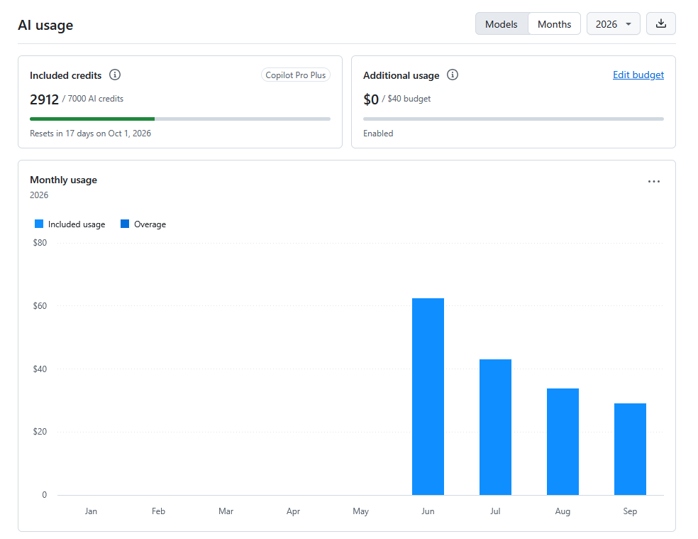
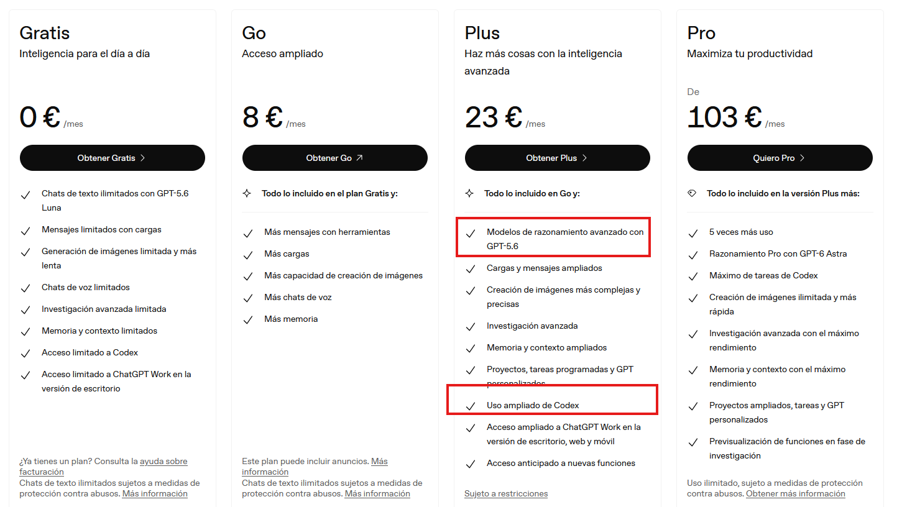
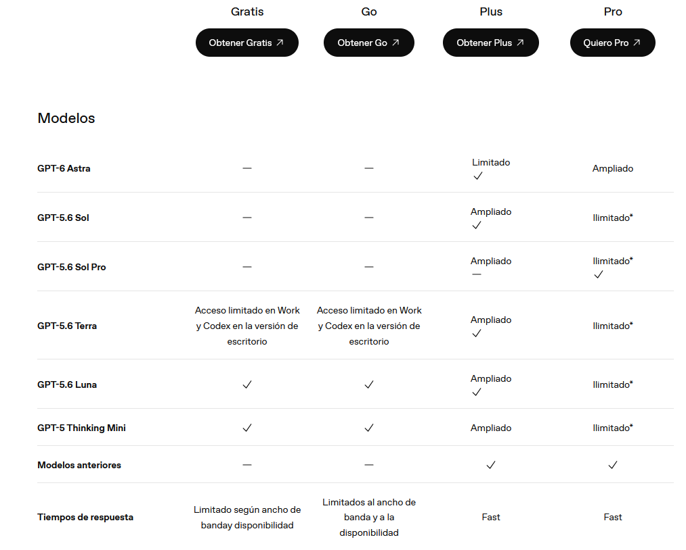
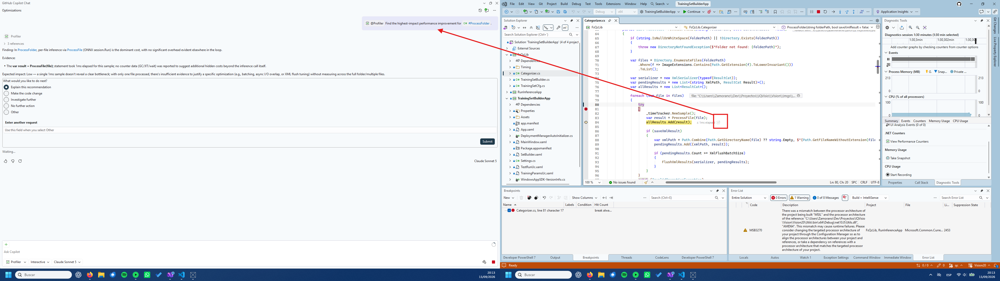
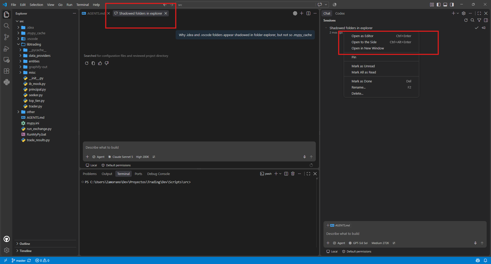
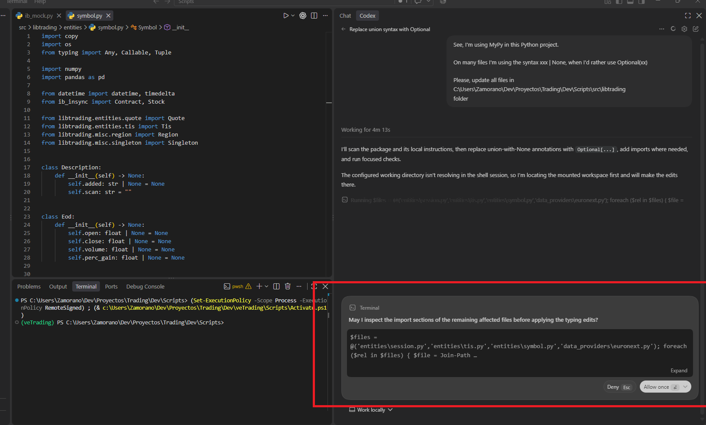
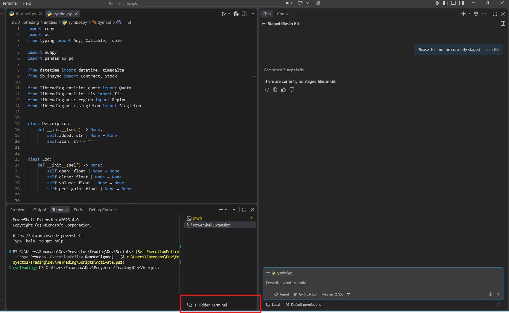

As I've written in my post about [GitHub Copilot Costs](), the only AI subscription I'm paying for right now is *GitHub Copilot*; a developer tool meant to be used alongside an IDE like Visual Studio 2026, Visual Studio Code, Jetbrains and so...

However, I sometimes feel the need for a general-purpose LLM assistant. Of course, I can fire up Visual Studio and ask GitHub Copilot whatever non-coding question comes to mind because the tool itself is just an LLM, extended with conveniences for software development. Furthermore, many functions that one might think are not strictly related to coding, like analyzing images, are also supported. However, this approach is inconvenient because when not working I don't feel like booting an IDE any time a question comes to mind. Regarding mobile usage, GitHub has an [Android app](https://play.google.com/store/apps/details?id=com.github.android&pli=1) I can use to chat with Copilot, but it is packed with repository utilities and other things I don't care about when not working. All in all, I get by using GitHub Copilot for my real-world interactions, but I have to admit is not really convenient.

By the time I wrote my previous post, I was using my own account at my day job. However, the company has recently purchased an enterprise CODEX plan, so each programmer gets a weekly allowance and I don't need to use my personal account anymore. Thus, my usage has been decreasing.

I'm thinking of downgrading my plan from *Pro+* to *Pro*. Obviously, I get fewer credits with the cheaper plan, but I also lose [access to advanced models](https://docs.github.com/en/copilot/reference/ai-models/supported-models#supported-ai-models-per-copilot-plan) like *GPT-5.6 Sol*, *GPT-6 Astra* or any *Claude Opus* model. In my experience for most tasks, I'm perfectly happy with *Claude Sonnet*, which is supported. It tends not to overdo things, and my workflow is based on manageable commits I can quickly review. However, I'm currently working on a Deep Learning project, a field I don't know much about, and now I do need advanced model support.

I've checked *ChatGPT Plus* plan, and it offers access to a general-purpose assistant, plus CODEX supporting advanced models so it covers my use-case better.

*Plus* plan supports even GPT-6 Astra!

Coding on my personal projects, I'd be using GitHub Copilot for most interactions and ChatGPT CODEX-Sol for domain-specific/hard questions. I'm already accustomed to CODEX from my daily use at work, but I like GitHub Copilot better. It fully integrates with Visual Studio 2026 and can do more; for example, it can even suggest performance improvements without asking; just press a button if you feel a method took longer than acceptable.

There is [a thread in the OpenAI forums](https://community.openai.com/t/codex-support-for-visual-studio-professional-please/1355249/5) asking for CODEX integration with vanilla Visual Studio, but it's not getting much traction.

Regarding Visual Studio Code integration, both assistants can be found in the secondary panel, but GitHub Copilot is located in the *Chat* section while CODEX adds its own. The chat window is more versatile; you can detach a conversation to the main edit area or to a standalone window. This is important for setups like mine, with two displays of moderate size, but those with an ultra-wide single-monitor setup probably won't care.

As said, another GitHub Copilot pro is not being limited to a single vendor. The user has a wide variety of models to choose from, across all major providers. With CODEX, you're stuck with OpenAI for better or worse.

I also like better the way GitHub Copilot runs commands in the terminal. While CODEX uses something behind the scenes you can't interact with

GitHub Copilot uses a hidden terminal you can open and type in, copy and examine whatever has been run

Regarding usage measurement, I talked about GH Copilot usage in my previous post and I found it quite comprehensible. ChatGPT/CODEX is more obscure. I only find an hourly allowance that resets daily and weekly but nothing like tokens or credits. I've been told by CODEX itself 

> That means you’re using Codex through your personal ChatGPT subscription, where usage is represented as a rolling hourly allowance—not as a visible token balance.
> Consequently:
> - You are not normally charged a separate dollar amount for each prompt.
> - The percentage/bar reflects your remaining included usage.
> - Consumption can vary with the model, reasoning level, context size, tools, and task duration.
> - OpenAI doesn’t currently expose an exact token count or dollar equivalent for each personal Codex prompt.
> - A credit balance appears only if additional usage credits are available for your account and you purchase or receive some.
> API billing is separate. If you use your own API key through platform.openai.com, you get token-based usage and monetary costs through the API Usage dashboard, calculated using the > published model rates.

To be honest, I find this method quite vague.

