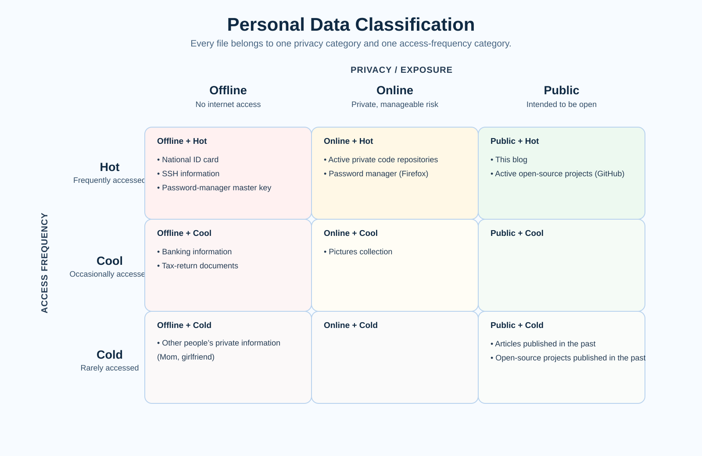
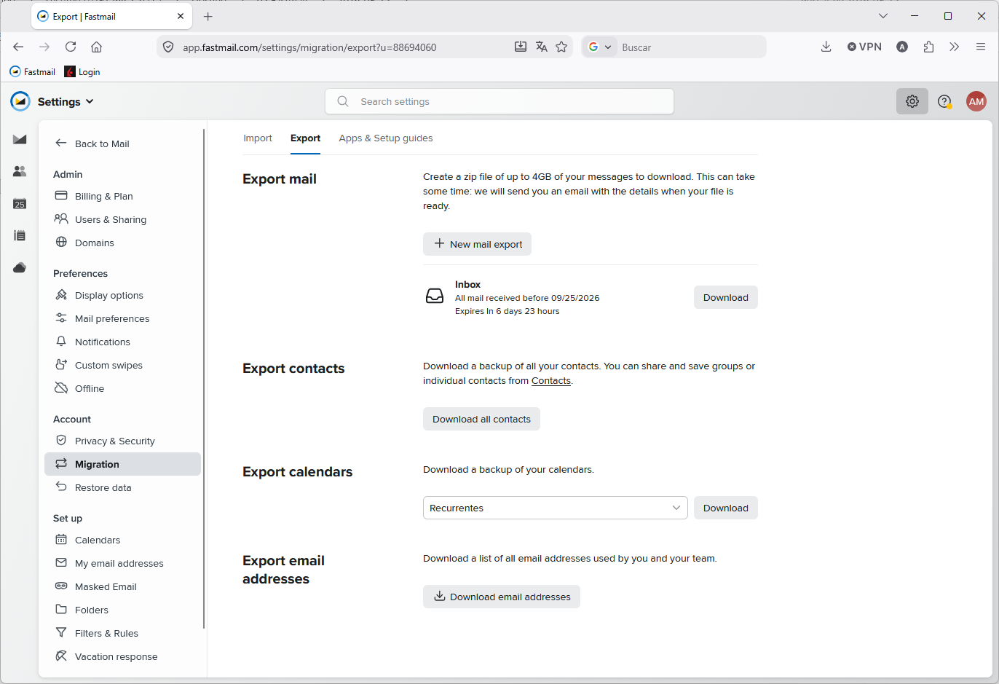
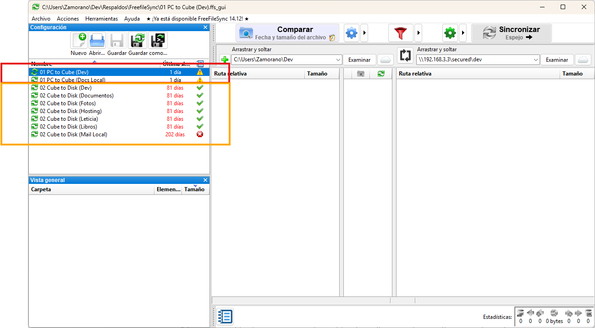
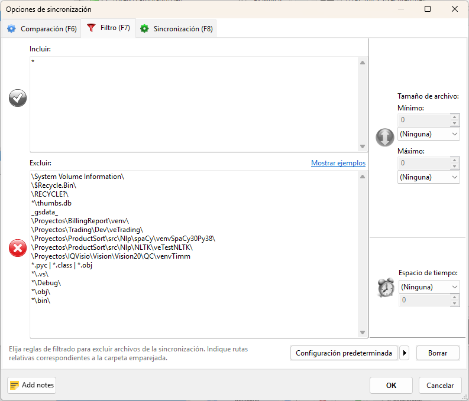
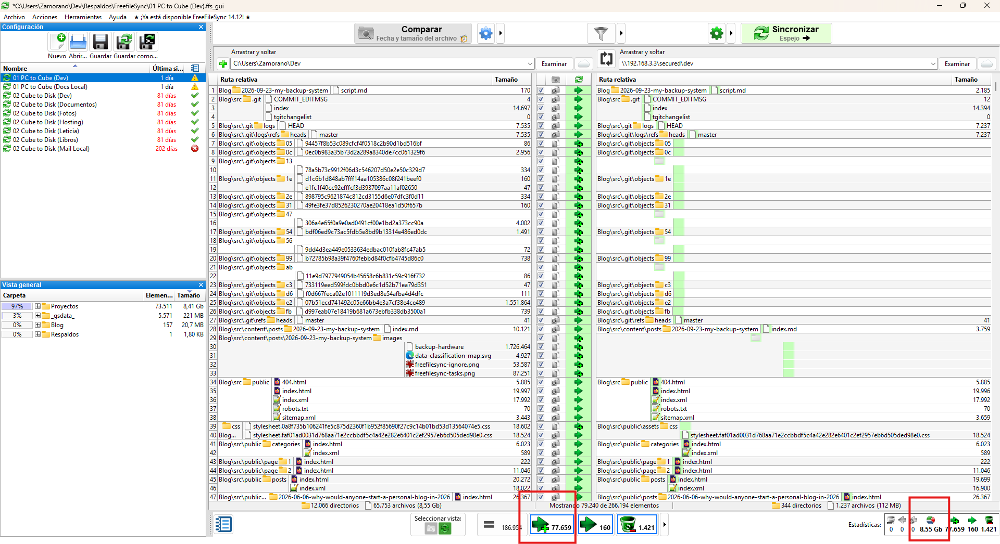

# How do most people store their data?

I often wonder how regular (non-computer) people keep their backups organized. Never mind being tech-savvy or not, I'd think everyone keeping their information in the digital world has a strategy in case things go wrong, their cell phone is stolen, computers break down, cloud account access is lost, or any other setback.

I think most people, 90%? keep their data using the big american tech conglomerates premises. iPhone/Mac users will store everything in Apple Cloud and Windows and Android users in OneDrive / Google Drive. But how many space do those providers grant for free? This is what ChatGPT has to say as of Sept 2026

| Ecosystem | Free cloud storage | Shared with |
| --- | --- | --- |
| Apple / iCloud | 5 GB | iPhone/iPad backups, iCloud Photos, iCloud Drive, Mail, etc. |
| Google / Google Drive | 15 GB | Google Drive, Gmail, and Google Photos |
| Microsoft / OneDrive | 5 GB | OneDrive files/photos, Outlook.com attachments, and Microsoft 365 app data |

> The notable exception is email: Microsoft also gives 15 GB of separate Outlook.com mailbox storage, while OneDrive’s 5 GB is the cloud-file quota.
> Although Android does not inherently require Google Drive—manufacturers and users can choose alternatives. In practice, Google’s 15 GB is the most generous of the three default bundles, but it fills with mail and photos as well as files.

I think those are fairly generous free allowances, but not enough for the regular folk that spends his holidays shooting pictures. Let's see what paying a fee takes you. These are Spanish prices:

| Provider | Paid storage tiers | Typical monthly price |
| --- | --- | --- |
| Apple iCloud+ | 50 GB · 200 GB · 2 TB · 6 TB · 12 TB | €0.99 · €2.99 · €9.99 · €29.99 · €59.99 |
| Google One | 100 GB · 200 GB | €1.99 · €2.99 |
| Microsoft / OneDrive | 100 GB · 1 TB · up to 6 TB family | €2 · €10 · €13 |

> A few practical distinctions:
> - Apple: storage is for one Apple ecosystem; the 200 GB plan and up can be shared with family.
> - Google: the quota covers Gmail, Drive, and Photos, and can be shared with up to five other people. Google also now sells larger AI bundles: 400 GB (AI Plus), 5 TB (AI Pro), and 20–30 TB (AI Ultra), but these are primarily AI subscriptions rather than straightforward storage upgrades.
> - Microsoft: 100 GB is Microsoft 365 Basic. The 1 TB Personal plan (€99/year) includes Office apps; the €13/month Family plan is six separate 1 TB allocations, not one pooled 6 TB bucket.

To me, all are good value for money, but I don't want to keep my personal data on foreign companies' servers, not just for privacy concerns (in the end, I'm a Windows user; you have to give something), but for the conflict of interests between a private wealthy foreign company and me. Maybe tomorrow an AI bot, trained to keep the interests of the company's lawyers and some department of the US state, would automatically flag my account as problematic. Who, then, am I going to complain to? These companies are famous for their lack of customer service, and for them, I'm a drop in the ocean, so they'd better remove my account than risk me being a terrorist or a non-law-abiding citizen. Although some people have proven it's possible to move things on Hacker News or Reddit and get the attention of an employee in a high enough position, this remains very unlikely.

I decided a long time ago that I wouldn't rely on any cloud or storage providers to keep my data, although I'm making my life more difficult. People choose the easy out-of-the-box solution because they are willing to trade privacy for convenience, knowingly or not. And about ther safety concern, that I hinted at in the above paragraph, honestly, how often have you heard about an Apple/Google/MS account being frozen, compared to people who lost their data after an external disk or a computer broke down. For your average non-computer guy, the safest option is to go with one of the major providers.

I need to implement a reasonable level of security while a keeping the effort to handle my backups low.

# What do I need? Categorizing the data I need to backup

I sort my data using a double hierarchy, according to privacy **Offline, Online, Public, External** and frequency of access **Hot, Cool, Cold**. Each file is sorted into one category for each hierarchy.

According to privacy, **Offline** data cannot be accessed through the internet. However, it would be acceptable to keep files in this category behind a VPN, only if it is managed by me. This category includes my house deed, banking information, SSH certificates, or passwords I don't keep in the manager. **Online** information is still private, only for my eyes, but unauthorized access wouldn't be the end of the world. It includes things like my pictures collection or private code repositories. I have very little **Public** information. It's limited to open source projects I keep on GitHub, and this blog. **External** is a special case and I leave it for later

Access frequency is, as expected, related to how new the information is. Everybody accesses newer information more often, but sometimes, a file can be quite old but still frequently accessed because it keeps a whole history, or simply, the older information is replaced by newer information. My pictures collection is **Cool Data**, my house scripture or the university practice I made 25 years ago is **Cold Data**. This blog, the repositories of active projects, and my national ID card are **Hot Data**.

Now, let's go back to **External** privacy category. No man is an island so although my desire is to be the sole owner of my data that won't happen as long as you use any online service. This is what *External* is for. The ownership of data stored in internet services is foggy as we have a mix of copyright, privacy and corporate laws that leaves the average guy clueless. I'm not elaborating on these topics as it is too hard and common sense does not seem to work anymore. I used to buy a book and I could not copy and sell it, but I could take it and read wherever and whenever I wanted, but that is no longer the case with internet services.

This is the list of internet services I use and want to back up

1. Audiobooks: Audible
2. Music: Spotify
3. eMail / Calendar / Contacts: Fastmail
4. TV: Netflix 
5. Gaming: Steam / GOG
6. Banking

First, let me keep it simple. On TV and gaming, I give up. I find modern TV boring and even if I didn't, saving such content is impractical; the juice is not worth the squeeze. On gaming, I rather buy through GOG as they are DRM-free but many titles are Steam-first. Anyway, I rarely play anymore, so the effort is not worth it neither.

On banking, every January I used to save all movements from the past year, but new EU regulations have made it a hassle, now 2FA is involved to download older than 90-day movements; that was the last straw and I also give up backing this up.

Now come the interesting cases. I'm a casual on TV and gaming, but not so with audiobooks. I curate my collection and appreciate most books I've read. I sometimes re-read those I found interesting. Of course *Audible* DRM-protects their books, so I had to find a workable system to remove DRM and store in an open format. I did manage to do it but I won't elaborate. I simply run an application against my library from time to time, and store the unlocked books on my server. That puts them in the backup loop.

On *Spotify*, It would be impossible to save all music I listen to, but I do want to keep my playlist, albums and favourite artists in an open format. I use [Exportify.net](https://exportify.net/) and [SpotMyBackup](http://www.spotmybackup.com/). Sadly as I'm writing I notice SpotMyBackup is not active anymore, but [somebody has forked](https://github.com/AlexanderMelde/MySpotBackup).

I also want to keep the information in Fastmail safe. This company is customer friendly and I'm not planning to leave their service anytime soon, but I'd rather keep my data safe. Them making so easy to export your data only makes me trust them more.

# My current setup

Four pieces of hardware are involved in my current setup:

1. MSI laptop; my daily workhorse
2. HP desktop server
3. External USB WD hard disk drive
4. Raspberry Pi 4B

I keep all *Offline-Hot* data in my **laptop**. I've used Bitlocker in the past, but since I got this computer I no longer take it out of the house; anyway I should re-enable it. All development information is on this computer, no matter its category. Usually repositories are of small size and if they have external artifacts, I store them elsewhere. If the repository is public, its `origin` will point to GitHub, otherwise it will point to my Raspberry.

The **HP desktop server** is still with me only for its storage; I don't care about its computing capabilities. It has 4TB in RAID 1 configuration. The server is usually powered down because it consumes a lot of energy. It has HP's proprietary iLO system offering several server-oriented capabilities, like remote wake and others, but even powered down, this server uses up too much power. So it makes sense to keep all *Cool/Cold* data here, because I don't care about storage size. As this computer cannot be remotely accessed, I cannot keep *Online* information. This is one of the main points for improvement, since it would be nice to have my pictures collection (*Online-Cool*) accessible from the outside, something like a private-only Instagram.

A basic norm of backup management is not to place all your systems in the same physical space. To comply, I use an **External WD hard drive**, which I used to keep at my mother's place, but since I no longer have that possibility, it has to move to my sister's.

Finally, the **Raspberry Pi** is not really there for its importance in my backup setup. I use it as an `origin` for my private repositories, but this is not really necessary since I already keep them backed up. The real reason is that some repos implement long-running background processes. My laptop gets suspended, powered on and off, so it is not really a good candidate to run those daemons and, as already said, the server wastes too much energy. I also need to run background tasks having nothing to do with my own sources, like a *DDNS daemon*.

This current setup is not perfect. My ideal would be replacing the *Server* by a low-powered NAS I can keep all day powered on and online. It should, somehow, have two different sandboxes, one accesible from the internet, and the other hidden behind a VPN. Ideally I could also replace the *Raspberry PI* for this sever to run those background tasks. I might address this on a future entry.

# Synchronization

The files on these hardware devices need synchronizing, in this direction:

`Laptop => Server => External HDD`

Whenever a file is found in the laptop, this is the source of truth that has to be copied to the other two devices. If a file is not found in the laptop, then the master is on the server and has to be copied to the external HDD.

In Linux-land they usually do these things using [rsync](https://es.wikipedia.org/wiki/Rsync), but it has no Windows version and is a CLI-only tool. I didn't feel like mastering a bunch of commands and I was already used to [GoodSync](https://www.goodsync.com/es) from the work I did in a past position. GoodSync is very convenient, its UI gives you a clear picture of all that is happening that I find very hard to grasp using a command line tool. However, I had to migrate because they focused on cloud infrastructure and monthly payments, good for business but not what I was looking for as a private low income user. Luckily I found [Free File Sync](https://freefilesync.org/) as a Windows alternative. Admittedly, its UI looks dated, but it works remarkably well and ONLY the looks are dated, because the functionality is all that I expected, and got used to with GoodSync. I quickly went for the *Donation Edition*, and as I write, have donated again. You don't need to, the application is honest about its name, it is really free, but if you find the software useful, I encourage you to support its developers.

I have configured a bunch of tasks. The first two copy from the *Laptop* to the *Server*. Everything else copies from the *Server* to the *External disk*

I've tried to keep sizes manageable by ignoring build artifacts and directories that became too big, like some *Python Virtualenvs* containing native frameworks.

It is noticeable when an unexpectedly big folder slides into the backup. I removed the ignore list just to try pressing Analyze

Am I, unexpectedly, about to copy 8.55GB and 77K new files? What did I do?
