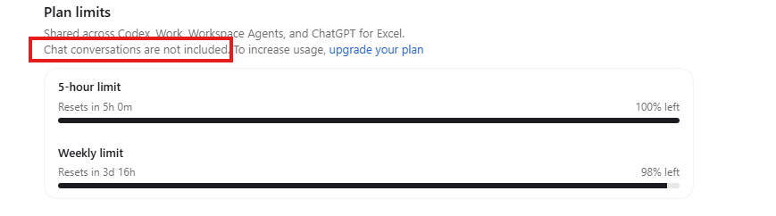

In [a previous post](), I wrote about why I decided to subscribe to ChatGPT. As a paying customer, I want to take advantage of the features the application provides, so I'm starting by installing the app. It turns out that two official OpenAI ChatGPT applications are listed in the Microsoft Store.

*Classic* is the old-fashioned version I was used to. It is much more advanced than the last time I checked, but nowadays the *Standard* ChatGPT app (the one without a qualifier) is the way to go if you want something more advanced than a conversational assistant. *ChatGPT Work* is OpenAI's hot new thing. It also looks like *Codex* is no longer a standalone application, and all its functionality is now blended into this one super app. I already know Codex and Classic ChatGPT, so let me explore Work and see what new features it provides.

For those outside the tech world, Simon Willison's blog is a renowned source. He has written an entry on [ChatGPT Work](https://simonwillison.net/2026/Aug/30/understanding-chatgpt-work/) in which he explains the main differences between *Chat* and *Work*. You can read more about them on his website.

I think he missed this, but an important distinction is that *Chat* conversations don't count toward the hourly limit.

