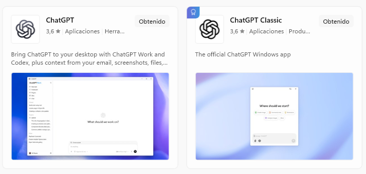
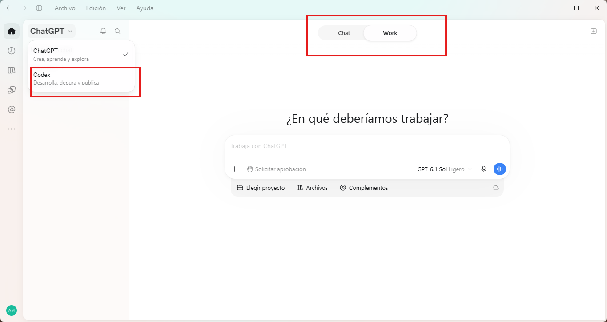
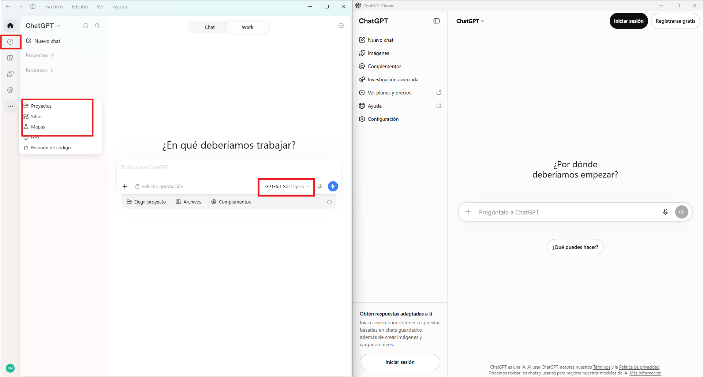

In [a previous post]() I wrote about why I decided to subscribe to ChatGPT. As a paying customer I want to take advantage of the features the application provides, so I'm first installing the application. Turns out, two official OpenAI ChatGPT applications are listed in Microsoft Store.

*Classic* is the old-fasihioned version I was used to. It is more more advanced than last time I checked but nowadays the *Standard (without qualifier)* ChatGPT is the way to go, if you want something more advanced than a conversational assistant and *ChatGPT Work* is the new OpenAI hot thing. Also, it looks like *CODEX* is no longer a standalone application, and all functionalities are now blended in this one super app. I know CODEX and Classic ChatGPT too so let me explore Work and see what new features are provided.

For those not in the tech world, a renowed source is Simon Willimson blog. He has written an entry on [ChatGPT Work](https://simonwillison.net/2026/Aug/30/understanding-chatgpt-work/) and has been able to figure out the main differences between Chat and Work. You can read more on this in his website

