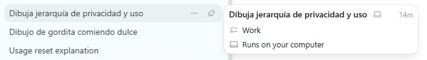
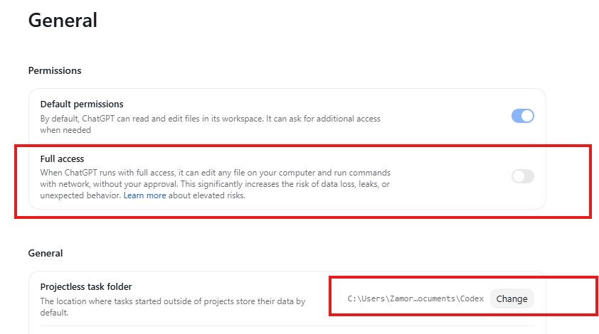
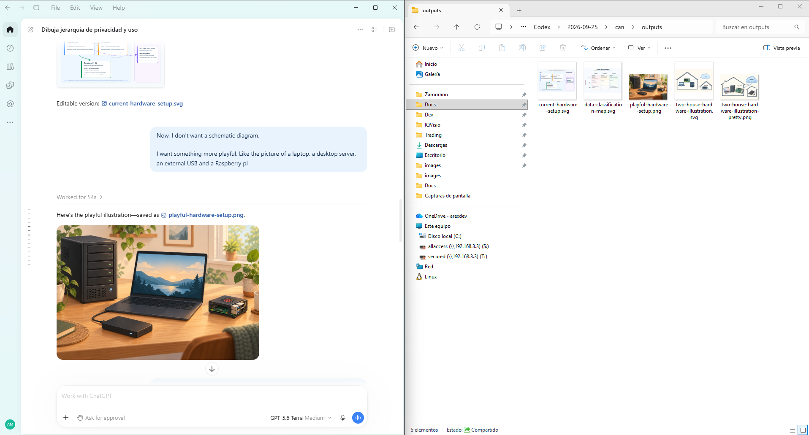
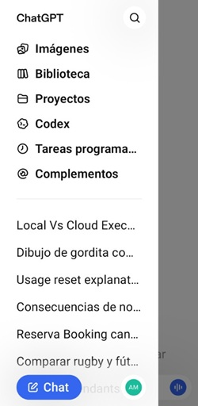
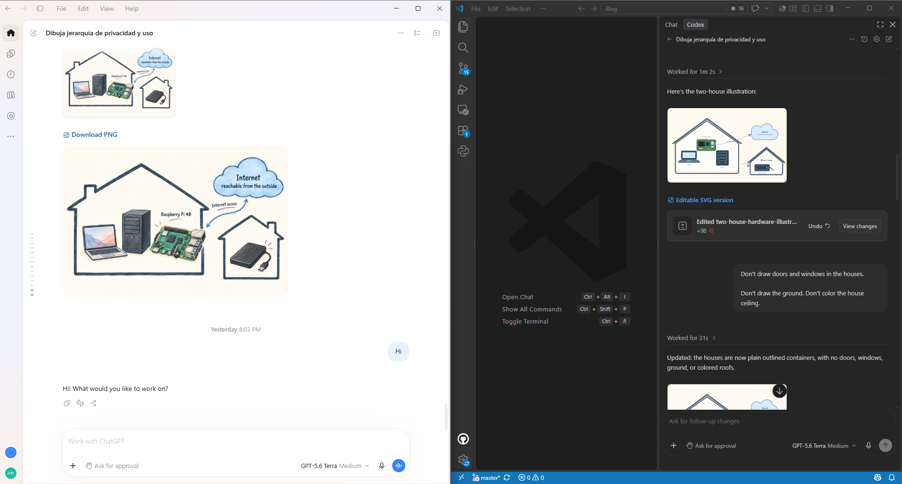
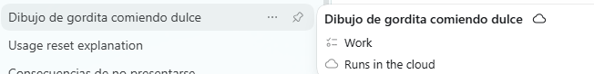
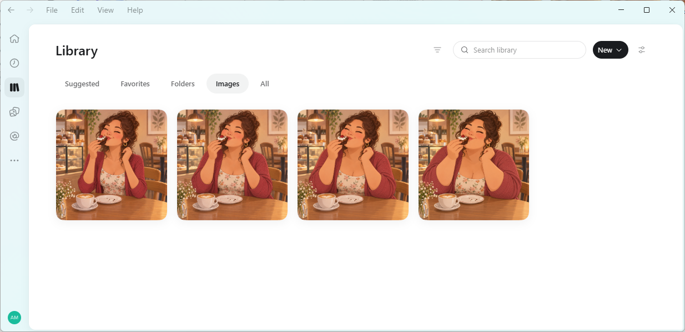
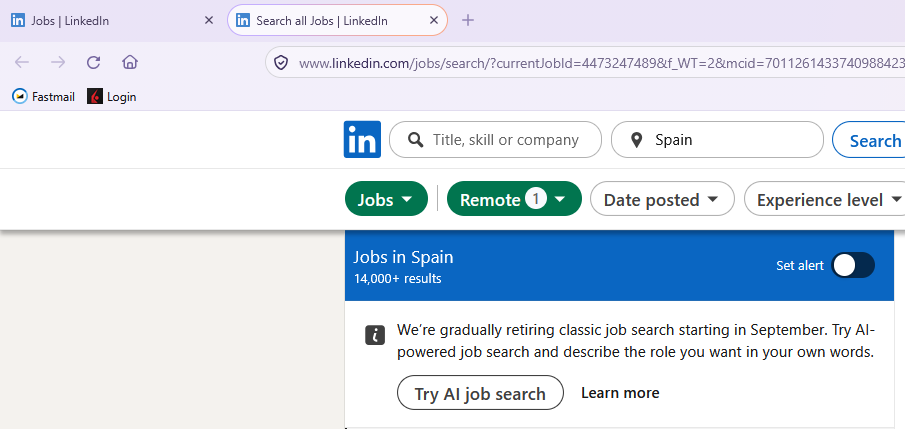

# What is ChatGPT Work?

In [a previous post](), I wrote about why I decided to subscribe to ChatGPT. Now a paying customer, I want to take advantage of the features the subscription provides, so I'm starting by installing the app. Turns out, two official OpenAI ChatGPT applications are listed in the Microsoft Store.

*Classic* is the previous version I was used to. Athough it is much more advanced than the last time I checked, nowadays the ChatGPT app (without a qualifier) is the way to go if you want something more advanced than a conversational assistant. ChatGPT *Work* is OpenAI's new hot thing. *Codex* is no longer a standalone application, and all its functionalities are now blended into this one super app. I already know Codex and Classic ChatGPT, so let me explore *Work* and see what new features it provides.

For those outside the tech world, Simon Willison's blog is a renowned source. He has written an entry on [ChatGPT Work](https://simonwillison.net/2026/Aug/30/understanding-chatgpt-work/) in which he explains the main differences between *Chat* and *Work*. This might be the more informative article on this topic apart from OpenAI's own documents. Anyway, I'm sharing here my own observations.

Apart than the distinctions he describes, I think he missed that *Chat* conversations don't count toward the hourly limit, so for simple queries, heavy users should choose this mode.

# Local vs. Cloud Execution

Each conversation is labelled as *running in the cloud* or *running locally*. I've reviewed my history and noticed two similar threads where I asked the agent to create some images. One is running in the cloud and the other locally. I asked the agent about the distinction:

>They refer to where the computer-use/work session is actually executing.
>- Running locally means ChatGPT is working through your own computer/environment. This is relevant when a task needs access to local files, locally installed applications, terminals, repositories, or resources only your PC can reach.
>- Running in the cloud means ChatGPT is using an isolated OpenAI-hosted computer. It has its own browser/environment and does not automatically have the same files, applications, network access, or logged-in browser sessions as your PC.

Back to the threads mentioned above. The first one runs on my computer

so I should find the images it has generated on my hard drive. I opened the settings and found the folder where the files for all *Work* conversations are stored. From Simon Willison's post, I understand that this is different from *Chat*, where all storage is temporary. I'm glad I checked because full disk access was enabled for the application. I don't remember knowingly granting such a high level of access. Maybe the request was phrased differently, or I got lazy and mindlessly pressed OK. Anyway, of course I switched it off.

The folder is indeed there and contains the generated files.

I assume I won't be able to find that conversation in the Android version of ChatGPT, and indeed, it is nowhere to be found.

However, I have CODEX locally installed as a Visual Studio code extension too, so I checked and the conversation is available there

Let me now examine the thread running in the cloud.

I asked the agent to draw a chubby girl eating a cake. After that I would make her slimer on subsequent prompts. I remember that when I first tried [DALL-E 2](https://en.wikipedia.org/wiki/DALL-E) (April 2022), creating image variations was not possible. Since then, they have overcome that limitation; see this awesome progression.

This thread is in the cloud and can be accessed from my cell phone.

The application provides access to your cloud files, but this is not like a Dropbox folder, stored locally and synchronized on the cloud; is cloud-only.

# Scheduled Tasks and Intelligent Search

The first time I installed ChatGPT, sometime ago, I wondered why are all developers so hell-bent on keeping their software running in the background. Heck, I just wanted to ask the chatbot a question and, close the application completely when I'm done. However, things have changed, now having a resident program makes more sense for running scheduled tasks.

It occurred to me that combining a scheduled task with the intelligence the LLMs provide could make for a better job search than LinkedIn's built-in search. Many job offers don't specify the net salary and, as far as I remember, LinkedIn's search filters don't provide an option to exclude such offers.

Before trying, I logged in to LinkedIn to check what kind of filters they were offering but, unsurprisingly, they're phasing out the traditional job search in favor of ai-assisted search.

Every company under the sun is making a big push on AI. Now, I feel my little experiment with ChatGPT Work no longer makes sense. I don't have the motivation anymore since I can just type the same prompt straight on LinkedIn. Hopefully more use cases will come to mind in the next days.

# Dots

This industry works at relentless pace. I was commenting how a ChatGPT Work conversation can be run on the cloud and how you can run scheduled tasks and, just a week ago, OpenAI introduced [Dots](https://openai.com/index/introducing-dots/) in what is the next step into full on-cloud always-on agents. It requires a *Pro Plan* and I have just started using my *Plus Plan*, so for now I'll pass, and try to make better use of *Plus*.

