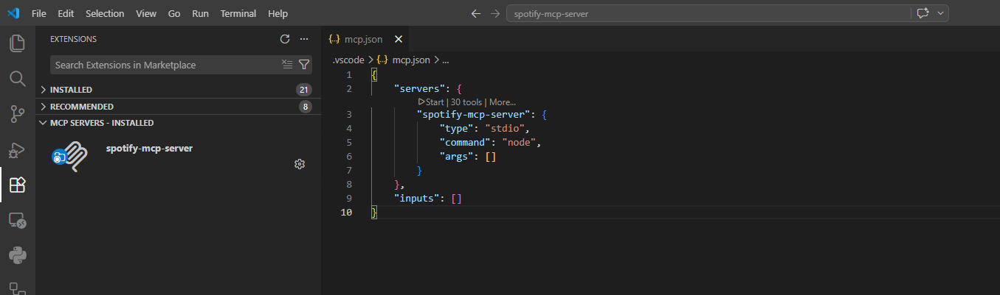
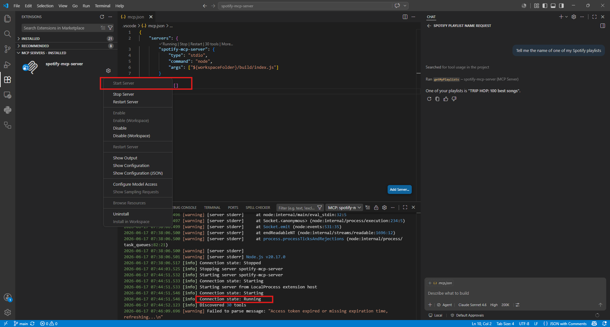
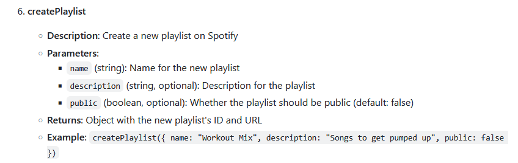
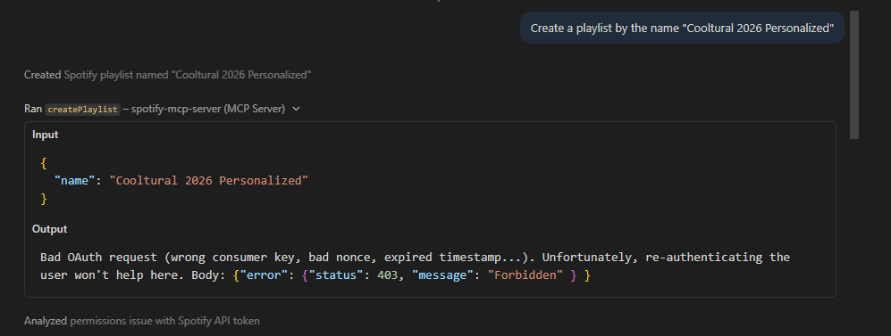
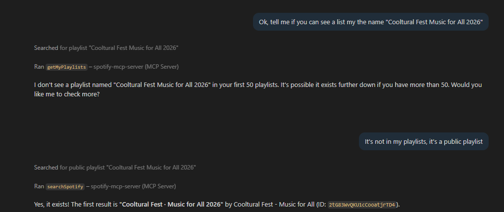
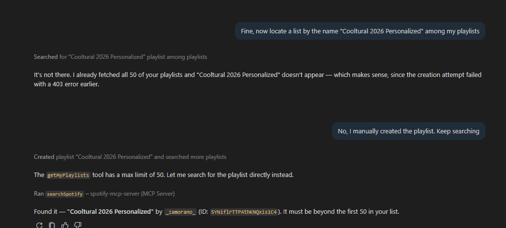
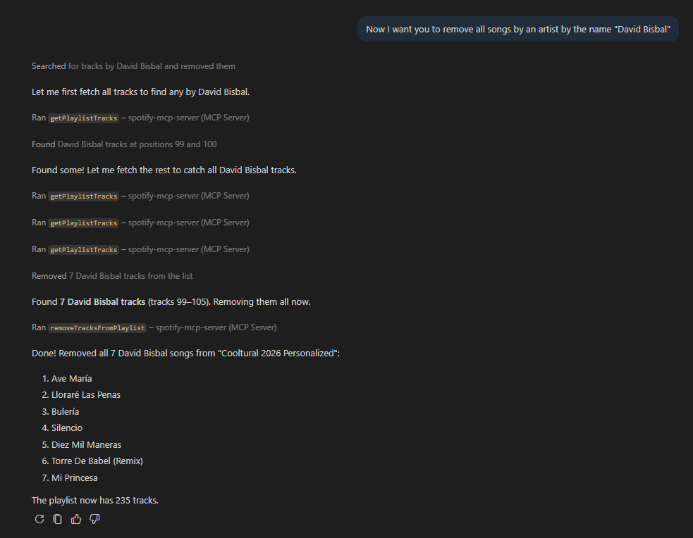
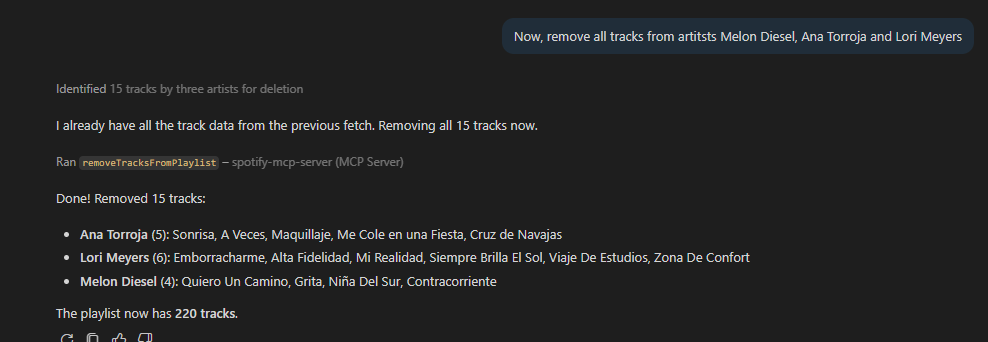

Since its first edition in 2018, I have been attending Cooltural Fest, a music festival that takes place yearly in my hometown of Almería.

I use the months before the festival to learn about new bands. The organization keeps an [official Spotify Playlist](https://open.spotify.com/playlist/2tG83WvQKU1cCooatjrTD4?si=83271bc58ae94a38) that I don't find very interesting since they, rightfully, emphasize the bigger bands and their most popular songs. Every year I copy all entries to my own list, trim most of the headliners' content, and keep adding entries from the smaller artists.

But what I like is hearing music while coding, not messing with Spotify UI and playlists. I thought it would be nice to speak to an AI chatbot and tell it exactly how I want my playlist built. In this brave new world of AI, Spotify might have deployed their own agent or MCP server. Turns out they haven't, but luckily some developer took the time to implement an MCP server for the streaming service.

# The setup

[Marcel Marais - Spotify MCP Server](https://github.com/marcelmarais/spotify-mcp-server)

At first glance, this looks fine. It has implemented the APIs I'll likely need. [I followed the setup instructions](https://github.com/marcelmarais/spotify-mcp-server#setup) step by step, found no problem and five minutes later, I had my Spotify MCP ready to run.

To interact with the agent, the author provides instructions for *Claude Desktop, Cursor and CLine Extension for VS Code*. As of today, my AI setup is GitHub Copilot for work and ChatGPT Free for everything else. I don't use Claude Desktop or Cursor. I do use Visual Studio Code, but its out-of-the-box GitHub Copilot chat is enough for me. My point is I didn't want to try the CLine extension this time, so I tried to set up the MCP server without any more extension installs.

First, I ran the *Add MCP Server* command. When asked for the type of MCP server, I selected *Command (stdio)*, typed *node* when asked for the command, and entered the server name. I chose to install the server only for the active workspace, so a new file was created in the active folder *.vscode\mcp.json*. The command line arguments must be filled manually as shown in the GitHub setup section. In the end, the mcp.json file should look like this

We're almost set. Now click Start Server in the sidebar and Voila! We have our agent ready to answer Spotify questions.

In the next post, I'll explore how clever the chatbot is and whether it's enough to build my perfect Cooltural 2026 playlist.

# Building the Playlist

According to the docs, playlist creation is supported

so I asked the chatbot to create my list, but it was unable

After several failed tries, I browsed the repo and found a [pull request](https://github.com/marcelmarais/spotify-mcp-server/pull/61) that fixes this problem, but I was not in the mood for cloning a different repo, so I created the list manually.

Now, I want the agent to locate the official playlist and the one I just created. The first one was correctly fetched

And so was the one I just created

I had copied all tracks from the official playlist. Now I want to prune the headliners. Let's start with David Bisbal. Nothing against him, I love how he promotes my hometown and seems a nice guy, but he's not the kind of artist I'm interested in when I attend an indie festival.

And kept removing artists

So far so good. I think for now it's enough for a proof of concept. Furthermore I'm happy with my playlist now. If I find more interesting use cases, I might write another entry in the future.