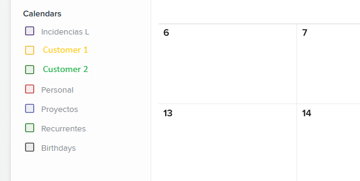
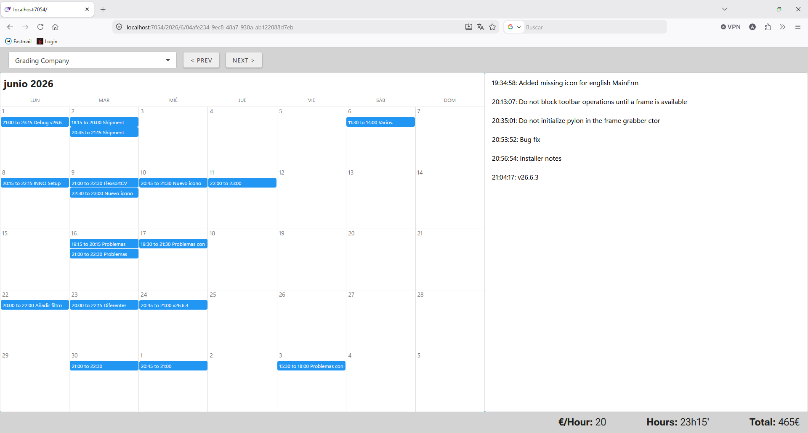

As many other developers, I keep a side-gig apart from my day-job.

I got first contacted by a colleague who asked whether I'd be willing to write a computer program for him and become partners. I'd do all the coding, bill him by the hour and also get a fee for each deployed system. He'd bring all the business logic, and the ability to get the money from the customer after you get the job done. It might be surprising for non spaniards, but this is not a given in my country.

I was wondering how to keep an honest track of the worked hours and how to clearly inform my partner of my progress. He's a computer scientist, same as me, but life lead him to the industrial sector. Although he's built real-world software used by actual customers and he's crafty and knowledgeable, he's not really aware of the latests tools and trends of the software world.

# Hourly tracking

To track the worked hours, I thought I could use an on-line calendar. I'm a heavy user of internet calendars. A long time ago I had all my apointments in  Google Calendar but after a phase trying to de-Google my life (I'll talk about that in another post) I explored a few alternatives and end up choosing FastMail.

They advertise themselves as *email and calendar made better* and that's what I've found. For a very reasonable price (60€/year) I keep my emails (using my own domain), on-line calendars, contact list, and 10 GB of online storage space to use as I please.

But back to the point. Now that I have an on-line calendar provider using an standard protocol (CalDAV/iCal) I can use its entries or appointments to keep track of the worked hours.

I keep a specific calendar for each customer, separate from others intended for personal usage.

# Activity description

I need to keep a good comprehensible description of each entry I place because the information I'm sending my partner each month is extracted from each calendar entry. The elapsed time and activity description.

Anyway, I felt like for some entries, specially those taking several hours, just the description might not give enough information. Why not sending the commit log from Git alongside each calendar entry? This might be overkill for most entries, but informative for some others.

# Putting everything together

For most of my career I've been a happy Windows desktop developer (yes, that's a thing). However, the industry favored web applications a long time ago so I felt like I was not in a good spot. Luckily, by being an experienced .NET developer, I landed a job at a company whose main product is a web application developed using [Blazor](https://dotnet.microsoft.com/en-us/apps/aspnet/web-apps/blazor)

I got hired just before LLMs took over. It's been only a few years but feels like forever. In those days ;-) before agents, creating a test project to show your skills was common practice. I wonder what do recruiters do nowadays. My potential employer was aware I was mostly a desktop developer, but gave me a shot to prove my .NET skills in a Blazor project.

I had a weekend to build a sample project and it came to my mind that I also had a good use-case, the one I have just explained, so it was time to get a hands-on experience on Blazor. The idea was to build a webapp to let my colleague follow my progress and justify payments

# The webapp

[EasyBillingReports3](https://github.com/AMArostegui/EasyBillingReports3)

The webapp it's a single page application consisting of only four Blazor components.

On top a dropdown lets me select customer. Naturally this is available only for me, as the root user. Each regular user can only see its own billing information. At the bottom, a status bar shows the overall amount of worked hours, fee and monthly payment. The middle is the detailed information section. On the left, it shows a calendar for the user to read the working hours for the active month. The user can click on each period for a detailed listing of available commits.

I have as many `*.settings.json` files as customers. The `Url` entry points to the internet calendar that stores the worked hours and `Repo` points to a local or online git repository for detailed information of each worked hour.

